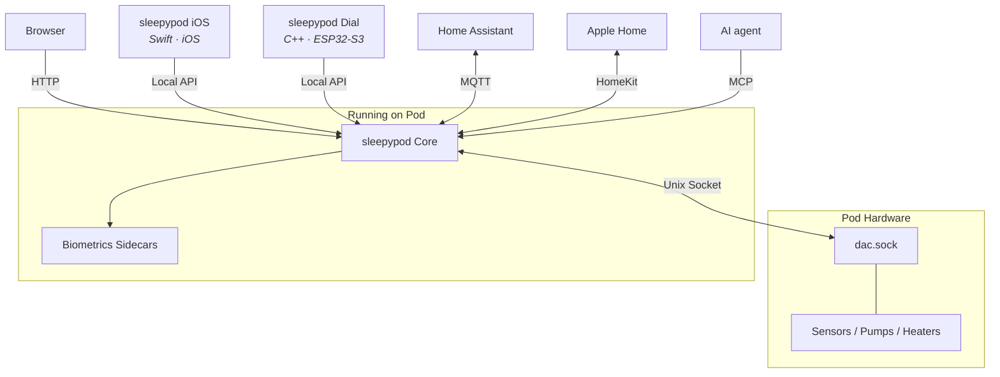

# sleepypod

Self-hosted control, scheduling, automation, and biometrics for Pod mattress covers (Pod 3, 4, and 5). Everything runs locally on the Pod's embedded Linux. No cloud account, no internet required.

**Video tour:** [See sleepypod Core in action](https://sleepypod.github.io/core/tour/)

**Docs:** [sleepypod.github.io](https://sleepypod.github.io/) · **Live demo:** [sleepypod.vercel.app](https://sleepypod.vercel.app) · **Community:** [Discord](https://discord.gg/UMmv5R6MXa) · **License:** AGPL-3.0

## Repositories

### [sleepypod Core](https://github.com/sleepypod/core)

The server that runs on the Pod. A local web app for per-side temperature, schedules, vibration alarms, and daily maintenance; Autopilot rules that react to signals and conditions, with backtests against recorded nights; on-device biometrics (heart rate, HRV, breathing rate, sleep staging) from the Pod's own sensors. Opt-in bridges for Home Assistant (MQTT) and Apple Home (HomeKit), and a Model Context Protocol server so an AI agent can read or control the Pod.

**Stack:** TypeScript, Next.js, React, tRPC, SQLite, Drizzle, Python biometrics sidecars

### [sleepypod iOS](https://github.com/sleepypod/ios)

Native iOS companion for temperature control and sleep tracking. Radial dial, schedule curves, biometrics charts, on-device sleep stage classification, and system health. Writes each night's stages and vitals to Apple Health and compares any night with what an Apple Watch recorded. Finds the Pod automatically over mDNS. A TestFlight beta is in progress; until then, build it from source with Xcode.

**Stack:** Swift 6, SwiftUI, Swift Charts · iOS 26+

### [sleepypod Dial](https://github.com/sleepypod/m5-rotary-dial)

A bedside controller built on the M5Stack Dial (ESP32-S3) for one side of the bed. Turn to set a target, click for off, and a red-on-black night theme after 10 pm. Includes a two-part printable enclosure, also on [MakerWorld](https://makerworld.com/en/models/3365781-sleepypod-dial-enclosure-for-m5stack-dial).

**Stack:** C++, PlatformIO, ESP32-S3

### [sleepypod.github.io](https://github.com/sleepypod/sleepypod.github.io)

The documentation site: product guides, developer reference, and real captures of every client.

**Stack:** Next.js, Nextra

## Ecosystem

All communication stays on your local network. Core keeps the Pod behind a LAN-only firewall policy, and the HomeKit and MQTT bridges are off until you enable them. sleepypod collects no data; see the [privacy policy](https://sleepypod.github.io/privacy/).

## Getting Started

Start with the [getting started guide](https://sleepypod.github.io/getting-started/), or try the [live demo](https://sleepypod.vercel.app) first. Coming from free-sleep? Follow the [migration guide](https://sleepypod.github.io/core/migrating-from-free-sleep/). See the [core README](https://github.com/sleepypod/core#readme) for installation details.
