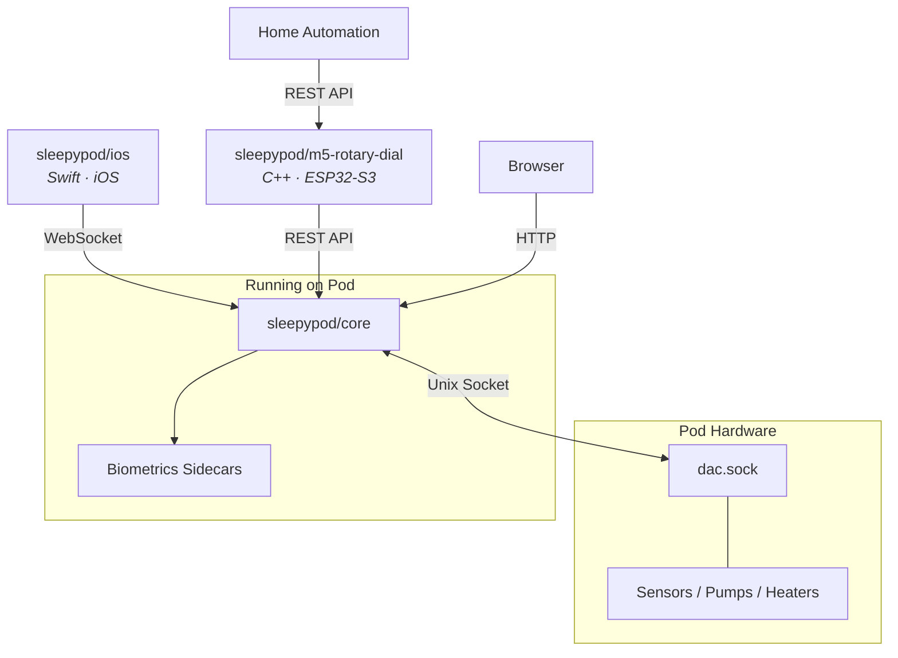

# sleepypod

Self-hosted control, scheduling, and biometrics for Pod mattress covers (Pod 3, 4, and 5). Everything runs locally on the Pod's embedded Linux — no cloud, no internet required.

## Repositories

### [core](https://github.com/sleepypod/core)

Full-stack server running on the Pod hardware. Next.js + tRPC web interface with per-side temperature scheduling, power management, vibration alarms, automated maintenance, and real-time biometrics (heart rate, HRV, breathing rate, sleep staging). SQLite-backed with Python biometrics sidecars for signal processing.

**Stack:** TypeScript, Next.js, tRPC, SQLite, Drizzle, Python

### [ios](https://github.com/sleepypod/ios)

Native iOS app for temperature control and sleep tracking. Radial dial interface, real-time biometrics charts, on-device sleep stage classification, and system health monitoring. Discovers the Pod automatically via mDNS.

**Stack:** Swift, SwiftUI, Charts, Core ML

### [m5-rotary-dial](https://github.com/sleepypod/m5-rotary-dial)

M5Stack Dial (ESP32-S3) firmware for physical temperature control. Rotary interface with a color arc display, automatic night mode, dual-side control, and a local API for home automation integration.

**Stack:** C++, PlatformIO, ESP32-S3

## Ecosystem

All communication stays on your local network. The Pod's internet access is disabled by default via iptables.

## Getting Started

See the [core README](https://github.com/sleepypod/core#readme) for installation and setup instructions.
